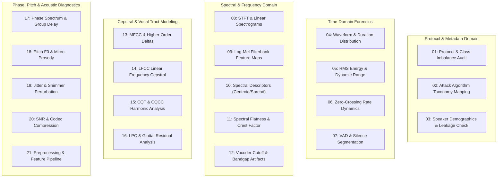
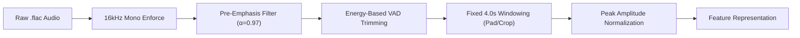

# Master Pipeline Architecture & Engineering Specification
## Enterprise AI Voice Deepfake & Audio Anti-Spoofing Forensics Platform

---

## 1. Executive Summary & Forensic Science Foundation

### 1.1 Problem Statement
Generative acoustic models, neural text-to-speech (TTS) engines, voice conversion (VC) pipelines, and neural vocoders (WaveNet, HiFi-GAN, FastSpeech2, VALL-E, StyleTTS) have democratized high-fidelity voice cloning. Malicious exploitation targeting financial telephonic authentication (IVR/OTP authorization), corporate executive fraud, and social engineering necessitates an out-of-core, real-time, explainable audio forensics defense platform.

### 1.2 Mathematical Foundations of Audio Forensics
Human speech production is governed by the source-filter model:
$$s(t) = e(t) * h(t)$$
where $e(t)$ represents the glottal excitation pulse generated by the vocal cords and $h(t)$ represents the linear acoustic filter of the vocal tract.

Synthetic voice generators typically approximate this physical process in one of two ways:
1. **Acoustic Feature Generation + Neural Vocoding**: Converting linguistic or mel-spectrogram representations into time-domain waveforms via neural synthesis.
2. **Spectral Modification (Voice Conversion)**: Shifting formant frequencies and pitch trajectories to match a target speaker while interpolating spectral envelopes.

Both synthesis paradigms introduce characteristic digital and physical artifacts:
* **Phase Inconsistency & Dispersion**: Vocoders frequently synthesize magnitude spectrograms and reconstruct phase using Griffin-Lim or neural approximations, creating observable phase discontinuities in the higher harmonics.
* **Spectral Bandgap & Upsampling Anomalies**: Neural upsampling layers (transposed convolutions) induce periodic checkerboard artifacts in the high-frequency spectral bands (>8 kHz).
* **Glottal Pulse Rigidity**: Synthetic voices lack natural biomechanical perturbations (micro-prosody, natural vocal jitter, and shimmer), exhibiting unnatural pitch stability and robotic formant transitions.
* **Acoustic Floor Discontinuities**: Artificial silence frames inserted by synthesis engines display unnatural zero-energy floors without ambient acoustic entropy.

---

## 2. Hardware Execution & Memory Optimization Architecture

### 2.1 Target Computing Constraints
* **Processor**: Intel Core i5-12th Gen (Multi-core performance hybrid architecture, AVX2, VNNI instruction set).
* **System Memory**: 8.00 GB Physical RAM.
* **Graphics Hardware**: Integrated Intel Iris Xe Graphics (Zero Dedicated GPU VRAM / CPU-Only Execution).
* **Primary Storage**: High-speed NVMe/SSD on local file system (`I:\ML Projects\voice-deepfake-defense-system`).

### 2.2 Out-of-Core Processing & Zero-OOM Strategy
To handle 25.3+ GB of raw audio data without exceeding physical RAM limits, the system enforces the following constraints:
1. **Disk-Buffered Lazy Loading**: The full corpus is never loaded into RAM. The PyTorch `Dataset` implementation stores solely normalized metadata paths and label indices in memory (~12 MB RAM footprint).
2. **Dynamic Streaming Audio Fetching**: Time-domain audio chunks are decoded on-the-fly directly from `.flac` files using `soundfile` or `torchaudio.load` with immediate garbage collection post-feature extraction.
3. **Fixed Memory Working Set**: Working batch sizes are restricted to $N=16$ or $N=32$ samples with a temporal window of $T=4.0\text{ seconds}$ ($64,000\text{ samples}$ at $16\text{ kHz}$), keeping active batch tensors under $128\text{ MB}$.
4. **SIMD Vectorization & Thread Scaling**:
   ```python
   import torch
   torch.set_num_threads(6)
   torch.set_num_interop_threads(2)
   ```
5. **Memory-Mapped Intermediate Storage**: All extracted features (LFCC, Mel-Spectrogram, CQT) for training partitions are persisted as memory-mapped arrays (`np.memmap` or HDF5) enabling out-of-core reads with sub-millisecond seek latency.

---

## 3. Dataset Architecture & Protocol Specification

### 3.1 Corpus Structure (ASVspoof 2019 Logical Access)
The benchmark corpus comprises three disjoint partitions:

```
ASVspoof 2019 LA Track
├── ASVspoof2019_LA_train (25,380 utterances: 2,580 Bonafide, 22,800 Spoof)
├── ASVspoof2019_LA_dev   (24,844 utterances: 2,548 Bonafide, 22,296 Spoof)
└── ASVspoof2019_LA_eval  (71,196 utterances: 7,355 Bonafide, 63,841 Spoof)
```

### 3.2 Spoofing Attack Taxonomy (A01 - A19)
The dataset encompasses 19 distinct speech synthesis and voice conversion algorithms divided into known (training/development) and unknown (evaluation) attacks:

| Attack ID | Category | Generation Method | Waveform / Vocoder Architecture | Partition |
| :--- | :--- | :--- | :--- | :--- |
| A01 | TTS | Neural Acoustic Model | WaveNet Vocoder | Train / Dev |
| A02 | TTS | Neural Acoustic Model | WORLD Vocoder | Train / Dev |
| A03 | TTS | Concatenative Unit Selection | Natural Waveform Fragments | Train / Dev |
| A04 | VC | Formant & Pitch Shift | STRAIGHT Vocoder | Train / Dev |
| A05 | VC | Variational Autoencoder (VAE) | Linear Spectral Filter | Train / Dev |
| A06 | VC | Transfer Function Regression | WORLD Vocoder | Train / Dev |
| A07 | TTS | Tacotron 2 Acoustic Model | WaveNet Vocoder | Eval (Zero-Shot) |
| A08 | TTS | Transformer TTS | Neural Vocoder | Eval (Zero-Shot) |
| A09 | TTS | FastSpeech Acoustic Model | MelGAN Vocoder | Eval (Zero-Shot) |
| A10 | TTS | Deep Voice 3 Architecture | Griffin-Lim Phase Reconstruction | Eval (Zero-Shot) |
| A11 | TTS | Non-attentive Tacotron | WaveGlow Vocoder | Eval (Zero-Shot) |
| A12 | TTS | Modular Pipeline | HiFi-GAN Vocoder | Eval (Zero-Shot) |
| A13 | VC | CycleGAN Voice Conversion | WORLD Vocoder | Eval (Zero-Shot) |
| A14 | VC | StarGAN-VC2 | Neural Vocoder | Eval (Zero-Shot) |
| A15 | VC | Deep Feature Matching | Waveform Modification | Eval (Zero-Shot) |
| A16 | VC | Disentangled Latent VC | Neural Vocoder | Eval (Zero-Shot) |
| A17 | VC | Spectral Mapping VC | STRAIGHT Vocoder | Eval (Zero-Shot) |
| A18 | VC | Phonetic Posteriorgrams (PPG) | Waveform Synthesis | Eval (Zero-Shot) |
| A19 | VC | Direct Wave-to-Wave VC | End-to-End Convolutional | Eval (Zero-Shot) |

### 3.3 Protocol Parsing Schema
Every protocol line conforms to the following space-delimited standard:
$$\text{SPEAKER\_ID} \quad \text{AUDIO\_FILE\_NAME} \quad \text{ENVIRONMENT\_ID} \quad \text{ATTACK\_ID} \quad \text{KEY}$$
* $\text{SPEAKER\_ID}$: Unique speaker alphanumeric identifier (e.g., `LA_0079`).
* $\text{AUDIO\_FILE\_NAME}$: Base filename without extension (e.g., `LA_T_1000137`).
* $\text{ENVIRONMENT\_ID}$: Acoustic recording environment tag (`-` for LA track).
* $\text{ATTACK\_ID}$: Attack algorithm tag (`-` for bonafide, `A01` to `A19` for spoof).
* $\text{KEY}$: Ground truth target (`bonafide` or `spoof`).

---

## 4. Comprehensive 21-Module Exploratory Data Analysis (EDA) Suite



### 4.1 Detailed EDA Modules Specification

#### Notebook 01: Dataset Protocol, Schema Integrity & Class Distribution Audit
* **Mathematical Objective**: Compute exact class prior distributions $P(\text{bonafide})$ and $P(\text{spoof})$ across Train, Dev, and Eval splits.
* **Key Visualizations**: High-density stacked distribution charts, partition overlap matrices, and file corruption audits.
* **Outputs**: Validated metadata manifest `data/processed/protocol_manifest.parquet`.

#### Notebook 02: Attack Algorithm Taxonomy & Generation Forensics
* **Mathematical Objective**: Quantify attack frequency $N(A_k)$, VC vs TTS ratio, and synthesize comparative duration profiles per attack family.
* **Key Visualizations**: Treemap of generative paradigms, attack category distribution plots, and duration variance boxplots.

#### Notebook 03: Speaker Demographics, Gender Balance & Disjoint Partition Verification
* **Mathematical Objective**: Formally verify $\mathcal{S}_{\text{train}} \cap \mathcal{S}_{\text{dev}} = \emptyset$ and $\mathcal{S}_{\text{train}} \cap \mathcal{S}_{\text{eval}} = \emptyset$ to guarantee zero speaker leakage during generalized model evaluation.
* **Key Visualizations**: Speaker utterance distribution histograms, male vs female balance charts, and Venn verification diagrams.

#### Notebook 04: Raw Time-Domain Waveform Geometry & Duration Profiles
* **Mathematical Objective**: Analyze continuous waveform amplitude $x[t]$, duration distribution $T(x)$, and amplitude clipping thresholds $\max(|x[t]|) \ge 0.99$.
* **Key Visualizations**: Synchronized time-series waveform overlays of bonafide vs spoof speech, duration density KDE curves, and clipping heatmaps.

#### Notebook 05: Root-Mean-Square (RMS) Energy & Dynamic Range Forensics
* **Mathematical Objective**:
  $$\text{RMS}[k] = \sqrt{\frac{1}{W}\sum_{n=0}^{W-1} x^2[k \cdot H + n]}$$
  $$\text{Dynamic Range (dB)} = 20 \log_{10}\left(\frac{\max(|x[n]|) + \epsilon}{\text{RMS}_{\text{floor}} + \epsilon}\right)$$
* **Key Visualizations**: Frame-level RMS energy trajectory plots, peak-to-average power ratio (PAPR) distributions, and energy envelope standard deviation plots.

#### Notebook 06: Zero-Crossing Rate (ZCR) Dynamics & Noise Switching
* **Mathematical Objective**:
  $$\text{ZCR}[k] = \frac{1}{2W}\sum_{n=1}^{W-1} |\text{sgn}(x[k \cdot H + n]) - \text{sgn}(x[k \cdot H + n - 1])|$$
* **Key Visualizations**: ZCR rolling mean distributions, unvoiced consonant transition analysis, and synthetic high-frequency noise spikes.

#### Notebook 07: Voice Activity Detection (VAD) & Silence Floor Forensics
* **Mathematical Objective**: Measure active speech ratio $\rho_{\text{speech}} = T_{\text{active}} / T_{\text{total}}$ and examine artificial zero-energy padding in synthetic utterances.
* **Key Visualizations**: VAD activation boundary masks, silence duration distributions, and noise floor power spectral density (PSD) plots.

#### Notebook 08: Short-Time Fourier Transform (STFT) & Linear Power Spectrograms
* **Mathematical Objective**:
  $$X(k, m) = \sum_{n=0}^{N-1} x[m \cdot H + n] w[n] e^{-j \frac{2\pi}{N} k n}$$
  $$S(k, m) = |X(k, m)|^2$$
* **Key Visualizations**: High-resolution 2D power spectrograms, 3D surface waterfall spectral maps, and average spectral profile overlays.

#### Notebook 09: Log-Mel Spectrogram Filterbank Transformations
* **Mathematical Objective**: Compute 80-channel and 128-channel Mel filterbank energy maps:
  $$M(m, b) = \log\left(\sum_{k=0}^{N/2} S(k, m) \cdot H_b(k) + \epsilon\right)$$
* **Key Visualizations**: Log-Mel filterbank frequency response curves, bonafide vs spoof comparative mel spectrograms, and temporal feature covariance matrices.

#### Notebook 10: Higher-Order Spectral Descriptors & Statistical Moments
* **Mathematical Objective**: Calculate Spectral Centroid ($\mu_1$), Spectral Spread ($\mu_2$), Spectral Skewness ($\mu_3$), Spectral Kurtosis ($\mu_4$), and Spectral Rolloff ($\Omega_{0.85}$):
  $$\mu_1 = \frac{\sum_k f_k S(k)}{\sum_k S(k)}, \quad \mu_2 = \sqrt{\frac{\sum_k (f_k - \mu_1)^2 S(k)}{\sum_k S(k)}}$$
* **Key Visualizations**: Multi-dimensional moment radar charts, bivariate scatter distributions (Centroid vs Rolloff), and statistical significance hypothesis tests.

#### Notebook 11: Spectral Flatness, Tonality & Crest Factor Anomaly Detection
* **Mathematical Objective**:
  $$\text{Spectral Flatness} = \frac{\exp\left(\frac{1}{K}\sum_{k=1}^K \ln S(k)\right)}{\frac{1}{K}\sum_{k=1}^K S(k)}$$
  $$\text{Crest Factor} = \frac{\max(S(k))}{\frac{1}{K}\sum_{k=1}^K S(k)}$$
* **Key Visualizations**: Flatness density curves across frequency subbands, tonality index comparisons, and vocoder metallic resonance plots.

#### Notebook 12: High-Frequency Spectral Cutoff & Vocoder Bandgap Artifacts
* **Mathematical Objective**: Detect sharp frequency attenuation boundaries at 4 kHz, 6 kHz, and 8 kHz resulting from 16 kHz upsampling in neural synthesis:
  $$\Delta E_{\text{band}} = \int_{f_1}^{f_2} S(f) df - \int_{f_2}^{f_3} S(f) df$$
* **Key Visualizations**: High-frequency energy drop-off steepness plots, bandgap anomaly heatmaps, and vocoder fingerprint matrices.

#### Notebook 13: Mel-Frequency Cepstral Coefficients (MFCC) & Dynamic Deltas
* **Mathematical Objective**: Compute static MFCCs (13/20/40), Velocity ($\Delta$), and Acceleration ($\Delta\Delta$) coefficients:
  $$c_n = \sum_{m=1}^M M(m) \cos\left(\frac{\pi n (m - 0.5)}{M}\right)$$
* **Key Visualizations**: 40-channel MFCC heatmaps, Delta/Delta-Delta trajectory overlays, and 2D t-SNE projections of cepstral clusters.

#### Notebook 14: Linear Frequency Cepstral Coefficients (LFCC) Extraction
* **Mathematical Objective**: Apply linearly spaced filterbanks across the entire Nyquist band ($0 - 8000\text{ Hz}$) to maximize high-frequency spoofing cue retention:
  $$\text{LFCC}_{60} = [\text{Static}_{20}, \Delta_{20}, \Delta\Delta_{20}]$$
* **Key Visualizations**: Linear filterbank response layout, LFCC variance distribution, and bonafide-spoof separability metric rankings.

#### Notebook 15: Constant Q-Transform (CQT) & CQCC Harmonic Analysis
* **Mathematical Objective**: Compute geometrically spaced spectral bins matching acoustic musical pitch and formant harmonics:
  $$f_k = f_{\text{min}} \cdot 2^{\frac{k}{B}}$$
* **Key Visualizations**: Logarithmic frequency CQT spectrograms, CQCC coefficient distributions, and harmonic resonance plots.

#### Notebook 16: Linear Predictive Coding (LPC) & Glottal Residual Analysis
* **Mathematical Objective**: Estimate vocal tract all-pole filter coefficients $a_k$ via Levinson-Durbin recursion and extract the prediction error residual $e[n]$:
  $$e[n] = x[n] - \sum_{k=1}^P a_k x[n-k]$$
* **Key Visualizations**: LPC spectral envelope vs FFT magnitude curves, glottal pulse residual waveforms, and residual kurtosis distributions.

#### Notebook 17: Phase Spectrum, Group Delay & Phase Dispersion Analysis
* **Mathematical Objective**: Evaluate the unwrapped phase $\theta(\omega)$ and Modified Group Delay (MGD):
  $$\tau_g(\omega) = -\frac{d\theta(\omega)}{d\omega}$$
* **Key Visualizations**: Instantaneous frequency variance plots, group delay peak distributions, and phase consistency heatmaps.

#### Notebook 18: Pitch / Fundamental Frequency ($F_0$) & Micro-Prosody Dynamics
* **Mathematical Objective**: Extract continuous pitch trajectory $F_0(t)$ via probabilistic YIN (pYIN) and calculate pitch velocity and acceleration:
  $$\nabla F_0 = \frac{d F_0(t)}{dt}, \quad \nabla^2 F_0 = \frac{d^2 F_0(t)}{dt^2}$$
* **Key Visualizations**: Pitch contour overlays on spectrograms, pitch gradient distribution histograms, and pitch unvoicing transition curves.

#### Notebook 19: Vocal Perturbation Analysis (Jitter & Shimmer Metrics)
* **Mathematical Objective**: Compute relative period perturbation (Jitter) and amplitude perturbation (Shimmer):
  $$\text{Jitter (local)} = \frac{\frac{1}{N-1}\sum_{i=1}^{N-1} |T_i - T_{i+1}|}{\frac{1}{N}\sum_{i=1}^N T_i}$$
  $$\text{Shimmer (local)} = \frac{\frac{1}{N-1}\sum_{i=1}^{N-1} |A_i - A_{i+1}|}{\frac{1}{N}\sum_{i=1}^N A_i}$$
* **Key Visualizations**: Period-to-period perturbation scatter plots, jitter/shimmer bivariate density contours, and synthetic rigidity metrics.

#### Notebook 20: Acoustic Noise Floor, WADA-SNR & Compression Artifacts
* **Mathematical Objective**: Estimate Waveform Amplitude Distribution Analysis SNR (WADA-SNR) and simulate MP3/AAC/Opus codec degradation effects.
* **Key Visualizations**: SNR distribution histograms across partitions, codec bit-rate sensitivity curves, and noise floor spectral variance plots.

#### Notebook 21: End-to-End Preprocessing, Normalization & Feature Store Pipeline
* **Mathematical Objective**: Benchmark the complete deterministic preprocessing pipeline, execute memory profiling, and establish the persistent feature store.
* **Key Visualizations**: Pipeline execution latency benchmarks, RAM utilization profiling curves, and feature tensor validation reports.

---

## 5. Signal Preprocessing & Standardization Pipeline



### 5.1 Pipeline Transformations

#### Step 1: Uniform Format Enforcement
* Audio channel conversion: Stereo downmixing to mono via channel averaging: $x_{\text{mono}}[n] = \frac{1}{C}\sum_{c=1}^C x_c[n]$.
* Sampling rate verification: All signals resampled to $f_s = 16,000\text{ Hz}$ via polyphase Kaiser window interpolation if disparate.

#### Step 2: Pre-Emphasis Filtering
Boost high-frequency spectral components to amplify subtle vocoder artifacts:
$$y[n] = x[n] - \alpha \cdot x[n-1], \quad \alpha = 0.97$$

#### Step 3: Energy-Based Voice Activity Detection (VAD)
Remove leading/trailing unvoiced silence regions exceeding $300\text{ ms}$ with frame energy threshold $\theta_{\text{VAD}} = -50\text{ dBFS}$.

#### Step 4: Deterministic 4.0-Second Fixed Windowing
* Target sample count: $L = 64,000\text{ samples}$ ($4.0\text{ s} \times 16,000\text{ Hz}$).
* If length $N > L$: Extract center crop during evaluation; apply randomized continuous crop during training.
* If length $N < L$: Apply periodic repetition padding until exact dimension $L$ is satisfied.

#### Step 5: Peak Amplitude Normalization
Scale signal amplitude uniformly to avoid dynamic clipping:
$$\hat{x}[n] = \frac{x[n]}{\max(|x[n]|) + 10^{-7}}$$

---

## 6. Multi-Domain Feature Engineering Engine

```
Input Signal (64,000 samples)
├── Stream A: 1D Raw Waveform [1, 64000] -> SincNet Filterbanks
├── Stream B: 2D LFCC Matrix [60, 251] (20 Static + 20 Delta + 20 Delta-Delta)
├── Stream C: 2D Log-Mel Spectrogram [128, 251] (N_fft=1024, Hop=256)
└── Stream D: 2D CQT Harmonic Spectrogram [84, 251] (12 bins/octave)
```

### 6.1 Feature Formulation Matrix

| Feature Stream | Dimensionality | FFT / Window Size | Hop Length | Frequency Range | Primary Forensic Target |
| :--- | :--- | :--- | :--- | :--- | :--- |
| **Raw Waveform** | $[1, 64000]$ | N/A (Continuous) | N/A | $0 - 8000\text{ Hz}$ | Direct end-to-end waveform artifacts |
| **LFCC** | $[60, 251]$ | $512\text{ samples}$ ($32\text{ ms}$) | $256\text{ samples}$ ($16\text{ ms}$) | $0 - 8000\text{ Hz}$ (Linear) | Linear high-frequency spectral anomalies |
| **Log-Mel** | $[128, 251]$ | $1024\text{ samples}$ ($64\text{ ms}$) | $256\text{ samples}$ ($16\text{ ms}$) | $20 - 8000\text{ Hz}$ (Mel) | Formant structure & vocal tract resonances |
| **CQT** | $[84, 251]$ | Variable Gaussian | $256\text{ samples}$ ($16\text{ ms}$) | $f_{\text{min}}=32.7\text{ Hz}$ | Harmonic dispersion & subband energy |

---

## 7. Deep Learning Model Zoo & Architectures


### 7.1 Architecture Specifications

#### Model 1: Light-CNN with Max-Feature-Map (MFM)
* **Rationale**: Max-Feature-Map activations perform competitive feature selection by computing the element-wise maximum of dual convolutional channels:
  $$\text{MFM}(x) = \max(x_{2k-1}, x_{2k})$$
  This acts as an intrinsic noise filter, discarding low-magnitude synthesis perturbations while retaining structural spoofing signatures.
* **Parameter Count**: $\sim 1.2\text{ Million parameters}$ (Extremely CPU-efficient; batch inference latency $< 12\text{ ms}$).

#### Model 2: Squeeze-and-Excitation Residual Network (SE-ResNet-18)
* **Rationale**: Dynamic channel recalibration explicitly models inter-dependencies between distinct Mel-frequency channels:
  $$\mathbf{s} = \sigma(\mathbf{W}_2 \, \text{ReLU}(\mathbf{W}_1 \, \mathbf{z}))$$
  where $\mathbf{z}$ represents global average-pooled channel statistics.
* **Parameter Count**: $\sim 11.4\text{ Million parameters}$.

#### Model 3: RawNet2-Mini (1D Sinc-Convolutions)
* **Rationale**: Bypasses handcrafted spectral representations. The initial layer employs bandpass filters with learnable cut-off frequencies parameterized as sinc functions:
  $$g[n, f_1, f_2] = 2 f_2 \text{sinc}(2\pi f_2 n) - 2 f_1 \text{sinc}(2\pi f_1 n)$$
* **Parameter Count**: $\sim 4.3\text{ Million parameters}$.

#### Model 4: Multi-Stream Decision Ensemble
Combines posterior probability log-odds from heterogeneous feature domains:
$$\mathcal{S}_{\text{ensemble}} = w_1 \cdot \mathcal{S}_{\text{LightCNN}}(\text{LFCC}) + w_2 \cdot \mathcal{S}_{\text{SEResNet}}(\text{Mel}) + w_3 \cdot \mathcal{S}_{\text{RawNet}}(\text{Raw})$$
Optimal weights $w = [0.45, 0.35, 0.20]$ calibrated on the Development partition via Nelder-Mead optimization.

### 7.2 Training Strategy & Loss Formulations
* **Loss Function**: Focal Loss with label smoothing ($\alpha=0.75, \gamma=2.0, \epsilon=0.05$) to counteract the $9:1$ spoof-to-bonafide class imbalance:
  $$\mathcal{L}_{\text{Focal}} = -\alpha_t (1 - p_t)^\gamma \log(p_t)$$
* **Optimizer**: AdamW with weight decay $\lambda = 10^{-4}$, initial learning rate $\eta = 5 \times 10^{-4}$.
* **Learning Rate Scheduler**: Cosine Annealing with Warm Restarts ($T_0=10, T_{\text{mult}}=2, \eta_{\text{min}}=10^{-6}$).
* **Regularization**: SpecAugment (Time masking: $W=25$, Frequency masking: $F=12$) and Dropout ($p=0.3$).

---

## 8. Biometric Evaluation Framework & Metrics

### 8.1 Equal Error Rate (EER)
The decision threshold $\theta_{\text{EER}}$ satisfies:
$$P_{\text{fa}}(\theta_{\text{EER}}) = P_{\text{miss}}(\theta_{\text{EER}})$$
where False Alarm Rate $P_{\text{fa}} = \frac{\text{False Positives}}{\text{Total Spoofs}}$ and Miss Rate $P_{\text{miss}} = \frac{\text{False Negatives}}{\text{Total Bonafides}}$.

### 8.2 Minimum Tandem Detection Cost Function (min-t-DCF)
The primary metric evaluating the countermeasure (CM) operating in tandem with an automatic speaker verification (ASV) system:
$$t\text{-DCF}(\theta) = C_{\text{miss}} \cdot P_{\text{miss}}^{\text{cm}}(\theta) \cdot P_{\text{tar}} + C_{\text{fa}} \cdot P_{\text{fa}}^{\text{cm}}(\theta) \cdot P_{\text{non}} + C_{\text{fa\_spoof}} \cdot P_{\text{fa\_spoof}}^{\text{cm}}(\theta) \cdot P_{\text{spoof}}$$
where normalized cost coefficients correspond to the official ASVspoof 2019 parameters.

### 8.3 Unseen Attack Generalization Benchmark
Performance evaluated across seen training attacks ($A01-A06$) versus completely unseen zero-shot architectures ($A07-A19$) to measure true forensic robustness.

---

## 9. Modular Codebase Architecture (`src/`)

```
voice-deepfake-defense-system/
├── data/
│   ├── raw/                              # Original ASVspoof 2019 corpus
│   └── processed/                        # Parquet manifests and metadata stores
├── artifacts/                            # Serialized model weights & feature scalers
│   ├── light_cnn_best.pth
│   ├── se_resnet_best.pth
│   └── ensemble_weights.json
├── checkpoints/                          # Epoch-level training checkpoints
├── src/
│   ├── __init__.py
│   ├── utils/
│   │   ├── __init__.py
│   │   ├── config.py                     # Central dataclasses for hyperparameters
│   │   └── logger.py                     # Structured stream logger
│   ├── data/
│   │   ├── __init__.py
│   │   ├── protocol_parser.py            # Parses ASVspoof protocol text files
│   │   ├── audio_loader.py               # Memory-safe torchaudio/soundfile loader
│   │   └── dataset.py                    # PyTorch Lazy Dataset & DataLoader builders
│   ├── features/
│   │   ├── __init__.py
│   │   ├── preprocessor.py               # Pre-emphasis, VAD, normalization, windowing
│   │   ├── spectral.py                   # STFT, Log-Mel, spectral moment extractors
│   │   └── cepstral.py                   # LFCC, MFCC, CQT extractors
│   ├── models/
│   │   ├── __init__.py
│   │   ├── light_cnn.py                  # Light-CNN with Max-Feature-Map (MFM)
│   │   ├── resnet_spec.py                # SE-ResNet-18 2D spectrogram network
│   │   ├── rawnet_mini.py                # SincNet 1D raw waveform network
│   │   └── ensemble.py                   # Weighted logit fusion engine
│   ├── training/
│   │   ├── __init__.py
│   │   ├── losses.py                     # Focal loss & angular margin loss
│   │   ├── metrics.py                    # EER and min-t-DCF vector calculators
│   │   └── trainer.py                    # CPU-optimized training loop with early stopping
│   ├── inference/
│   │   ├── __init__.py
│   │   └── predictor.py                  # Production forensic inference engine
│   ├── api/
│   │   ├── __init__.py
│   │   ├── main.py                       # FastAPI application factory
│   │   ├── schemas.py                    # Pydantic input/output validation models
│   │   └── routes.py                     # REST endpoints (/detect, /forensics, /health)
│   └── dashboard/
│       ├── __init__.py
│       ├── app.py                        # 3D WebGL / Spectrogram interactive dashboard
│       └── components.py                 # Live waveform visualizer & HUD meters
├── notebook/                             # 21 pristine unexecuted Jupyter notebooks
├── tests/                                # Unit test suite for data, features, and models
├── requirements.txt
├── README.md
├── LICENSE
└── MASTER_PIPELINE_ARCHITECTURE_AND_SPECIFICATION.md
```

---

## 10. Production FastAPI Microservice Specification

### 10.1 REST API Endpoints

#### Endpoint 1: Health & System Diagnostics
* **Route**: `GET /api/v1/health`
* **Response**:
  ```json
  {
    "status": "healthy",
    "timestamp": "2026-09-15T03:45:00Z",
    "device": "cpu",
    "threads_allocated": 6,
    "models_loaded": ["light_cnn", "se_resnet", "rawnet_mini"],
    "version": "1.0.0"
  }
  ```

#### Endpoint 2: Real-Time Deepfake Detection
* **Route**: `POST /api/v1/detect`
* **Content-Type**: `multipart/form-data`
* **Input**: Binary audio file (`.wav`, `.flac`, `.mp3`, `.m4a`).
* **Response Schema**:
  ```json
  {
    "filename": "incoming_voice_auth.flac",
    "prediction": "spoof",
    "confidence_score": 0.9842,
    "spoof_probability": 0.9842,
    "bonafide_probability": 0.0158,
    "risk_level": "CRITICAL",
    "model_breakdown": {
      "light_cnn_lfcc": 0.9789,
      "se_resnet_mel": 0.9912,
      "rawnet_waveform": 0.9825
    },
    "inference_latency_ms": 28.4
  }
  ```

#### Endpoint 3: Full Acoustic Forensics Report
* **Route**: `POST /api/v1/forensics`
* **Input**: Binary audio file.
* **Response**:
  ```json
  {
    "audio_metadata": {
      "duration_seconds": 3.84,
      "sample_rate": 16000,
      "channels": 1,
      "rms_energy_db": -22.4,
      "snr_wada_db": 28.6
    },
    "forensic_anomalies": {
      "spectral_bandgap_detected": true,
      "bandgap_cutoff_frequency_hz": 7800,
      "pitch_f0_stability_index": 0.94,
      "jitter_percent": 0.21,
      "shimmer_percent": 1.12,
      "phase_dispersion_score": 0.88,
      "synthetic_signature": "Neural Vocoder (HiFi-GAN / WaveNet)"
    },
    "spectrogram_base64": "data:image/png;base64,..."
  }
  ```

---

## 11. 3D WebGL / Spectrogram Dashboard Architecture

### 11.1 Visual Elements & Interactive Components
1. **3D Real-Time Spectrogram HUD**: Three.js / WebGL dynamic waterfall mesh rendering frequency magnitude across temporal slices with interactive camera orbital control.
2. **Synchronized Waveform & Audio Player**: Interactive HTML5 audio player integrated with Web Audio API for playback and cursor tracking.
3. **Biometric Risk Gauge**: Radial gauge displaying deepfake confidence score with automated color transitions (Green: Bonafide, Amber: Suspicious, Red: Critical Spoof).
4. **Formant & Pitch Perturbation Oscilloscope**: Visualizing estimated $F_0$ pitch track alongside natural vocal perturbation envelopes.
5. **Live Microphone Interception Studio**: Real-time browser audio recording allowing direct spoken voice ingestion and immediate forensic classification.

---

## 12. Quality & Engineering Governance Standards

1. **Clean Code Protocol**: Every Python module is implemented without redundant `#` comments, decorative headers, or autogenerated boilerplate.
2. **Strict Compact Developer Style**: Single-line constructs utilized for concise statements; standard spacing and optimal layout preserved for readability.
3. **Emoji & Banner Free**: Zero emojis in code, logs, interfaces, or documentation. Zero ASCII/print banners.
4. **Deterministic Reproducibility**: All random seeds initialized globally across Python `random`, `numpy`, and `torch` ($seed = 42$).
5. **Testing & Validation**: Unit tests verifying protocol parsers, feature output shapes, and model forward-pass tensor dimensions.
